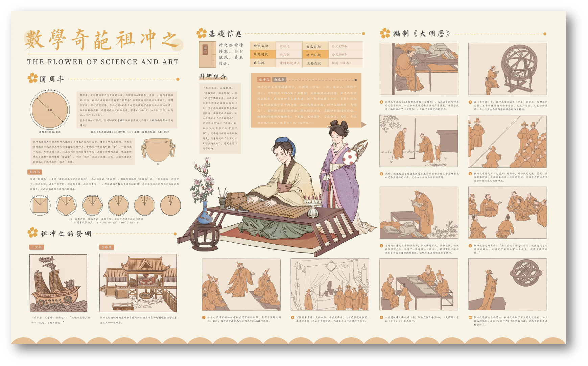

这里是 第17届中国大学生计算机设计大赛-信息可视化组祖- “为往圣继绝学”-细数华夏科艺之花 团队的主页，最新的消息和作品产品展示都会在这里进行更新🥰

# 🔥 News

- 2024.5 我们的作品 “为往圣继绝学”-细数华夏科艺之花 正式参加第17届中国大学生计算机设计大赛啦🥰
- 2024.4 线上推广主页正式建立~

# ✍ Figure Design

**【信息图设计】**

-  我们的主产品是以下六幅精心设计绘制的信息图，包括：
  - 华夏科艺之花（科） 之 治水典范-李冰
  - 华夏科艺之花（科） 之 造纸宗匠-蔡伦
  - 华夏科艺之花（科） 之 数学奇葩-祖冲之
  - 华夏科艺之花（艺） 之 东方莎翁-汤显祖
  - 华夏科艺之花（艺） 之 书法圣手-王羲之
  - 华夏科艺之花（艺） 之 妙笔成风-吴道子
- 在当今中国古代科学艺术文化宣传同质化严重的情况下，通过信息可视化设计的形式展示中国古代科学巨匠和艺术大师的生平事迹，科学与艺术相结合，古时文化和现代艺术相结合，以完美展示中国古代科学艺术领域的卓越成就；同时还可以制作相应的Q版表情包的形式，打造一系列的“华夏科艺之花”主题的Q版IP形象，并通过多渠道进行昨天的线上/线下推广，以提升公众对中国古代科学和艺术的认识和了解，向人们传递中国古代科学艺术主题的国家品牌信息，大大降低了记忆传播成本，提高了中国古代科学艺术这个中国品牌成功刷屏的几率，增强国家文化自信。

**【主图设计】**

-  我们将各信息图的主图抽离并合并，形成我们的合并主图

# 😉 Emoji

**【表情包设计】**

-  我们的表情包如下，欢迎大家自取使用喔🥰
-  微信表情包正在上线中，敬请期待~

# 🎁 Cultural Products

**【周边文创】**

-  这是我们设计的周边文创~

|  |   |  |
| :----------------------------------------------------------: | :----------------------------------------------------------: | :----------------------------------------------------------: |
|  | |  |
|  |  |  |
|  |  |  |
|  |  | |

# 💡 Thoughts of Design

**【设计思路】**
-  why choose 【“为往圣继绝学”-细数华夏科艺之花】 这样一个主题？
- 在当今中国古代科学艺术文化宣传同质化严重的情况下，通过信息可视化设计的形式展示中国古代科学巨匠和艺术大师的生平事迹，科学与艺术相结合，古时文化和现代艺术相结合，以完美展示中国古代科学艺术领域的卓越成就；同时还可以制作相应的Q版表情包的形式，打造一系列的“华夏科艺之花”主题的Q版IP形象，并通过多渠道进行昨天的线上/线下推广，以提升公众对中国古代科学和艺术的认识和了解，向人们传递中国古代科学艺术主题的国家品牌信息，大大降低了记忆传播成本，提高了中国古代科学艺术这个中国品牌成功刷屏的几率，增强国家文化自信。

**【作品架构】**
- 主作品：<a href="#信息图">信息图设计</a>
  - 首先重中之重的是，我们的主要作品是六幅精心设计绘制的信息图
  - 【华夏科艺之花（科） 之 治水典范-李冰】的设计过程

| **设计初稿** | **色彩应用** | **概念发展** | **细节调整** | **最终作品** |
|--------------|--------------|--------------|--------------|--------------|
|  |  |  |  |  |

  - 【华夏科艺之花（科） 之 造纸宗匠-蔡伦】的设计过程

| **设计初稿** | **色彩应用** | **概念发展** | **细节调整** | **最终作品** |
|--------------|--------------|--------------|--------------|--------------|
|  |  |  |  |  |

  - 【华夏科艺之花（科） 之 数学奇葩-祖冲之】的设计过程

| **设计初稿** | **色彩应用** | **概念发展** | **细节调整** | **最终作品** |
|--------------|--------------|--------------|--------------|--------------|
|  |  |  |  |  |

  - 【华夏科艺之花（艺） 之 书法圣手-王羲之】的设计过程

| **设计初稿** | **色彩应用** | **概念发展** | **细节调整** | **最终作品** |
|--------------|--------------|--------------|--------------|--------------|
|  |  |  |  |  |

  - 【华夏科艺之花（艺） 之 东方莎翁-汤显祖】的设计过程

| **设计初稿** | **色彩应用** | **概念发展** | **细节调整** | **最终作品** |
|--------------|--------------|--------------|--------------|--------------|
|  |  |  |  |  |

  - 【华夏科艺之花（艺） 之 妙笔成风-吴道子】的设计过程

| **设计初稿** | **色彩应用** | **概念发展** | **细节调整** | **最终作品** |
|--------------|--------------|--------------|--------------|--------------|
|  |  |  |  |  |

- 衍生作品：<a href="#表情包">表情包</a>
  - 表情包也因其在信息时代的使用率，被纳入了我们的考虑范围内
- 衍生作品：<a href="#文创">文创设计</a>
  - 将信息图以相应衍生IP的形式融合到各种创意产品中，为后续推广奠定基础 

# 📝 Feedback and Update

**【反馈与迭代】**
为了方便各位评审老师更深入了解我们的设计流程，我们把每一代内测结果的反馈和迭代结果也公开在了主页上。

- **第一次内测**
  - **时间**：2024/3/28
  - **对象**：同院同级同学约10人左右
  - **方式**：对初步设计的3个信息图设计（李冰、蔡伦、祖冲之）进行美观程度、信息丰富度、教育意义三个方面的打分，以及收集后续建议
  - **反馈1**-平均得分情况（满分10分）：美观程度9.0，信息丰富度8.5，教育意义7.5
  - **反馈2**-相关建议：信息图设计十分精美，但希望可以不仅涉及到科学领域的人物，还应该包括一些文艺领域的人物
  - **相应修改**（已完成）：新增了汤显祖、王羲之和吴道子的IP设计
- **第二次内测**
  - **时间**：2024/4/17
  - **对象**：在校内以问卷形式收集了30位在校大学生的问答情况
  - **方式**：对新推出的多个信息图进行打分，评价标准和第一次内测类似
  - **反馈1**-平均得分情况（满分10分）：美观程度9.3，信息丰富度9.1，教育意义8.5
  - **反馈2**-相关建议：推出其他周边会更好
  - **相应修改**（已完成）：进行信息图、表情包和文创等周边产品的设计。
- **第三次内测**
  - **时间**：2024/4/27
  - **对象**：问卷形式收集了50位校外人员问答情况，作答者平均年龄28.7岁
  - **方式**：对新推出的表情包和文创进行打分，主要评价美观程度
  - **反馈1**-平均得分情况（满分10分）：表情包美观程度9.3，表情包美观程度9.1
  - **反馈2**-相关建议：表情包的设计非常有意思，但是涵盖的内容有点少；同时如果能进行动态延伸设计，可能会拥有更广阔的传播量
  - **相应修改1**（已完成）：更新了其他表情、神态的表情包
  - **相应修改2**（进行中）：对每种内容的表情包进行逐帧设计和拼接，生成动态表情包；同时考虑在微信等社交平台上限我们的表情包
- **第四次内测**
  - **时间**：2024/4/29
  - **对象**：同校不同院的50名大学生
  - **方式**：于4月29日下午在多媒体教室同时对线上宣传页内容进行10min浏览并打分
  - **反馈1**-平均得分情况（满分10分）：页面美观程度9.3，内容展示设计9.0，浏览体验8.7
  - **反馈2**-相关建议：页面整体很美观，内容也很详实，但是有时候图片加载比较缓慢
  - **相应修改**（已完成）：由于页面是托管在github上的，而在国内访问github速度较慢，所以对于页面图片嵌入进行了进一步的压缩，以减少页面负载

# 💪 Obstacles

**【设计难点】**

重难点基本上就是之前的设计部分了！

从选题到最后的作品呈现，没有一个环节是非常轻松就能完成的，这也感谢几位队友之间的默契配合，让我们团队效率大大提升；同时指导老师给予的关键点拨也让我们能够在ddl之前完成作品展示。 

# 💬 Our Messages

**【作者们的话】**

设计不易，希望大家喜欢！
